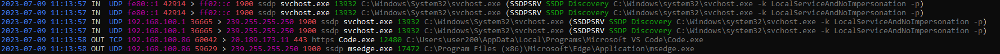

# Firewall log

A command-line application showing connections recently blocked by Windows Firewall.

## Usage

```
git clone https://github.com/milan11/firewall_log.git
cd firewall_log/FirewallLog
dotnet build
```

Then, run FirewallLog.exe as Administrator.
Running as Administrator can be configured to happen automatically:

- FirewallLog.exe Properties
- Compatibility tab
- check Run this program as an administrator

The application waits for the Enter key at the end (by calling `Console.ReadLine()`) so that the console window stays open.

## When to use

Showing of the recently blocked connections helps to see what Allow rules to create if something does not work. This utility shows the details needed to carefully craft the most specific rules.

### Case A: To see blocked incoming connections

By default, Windows Firewall blocks all incoming connections.
When you run some server on your computer and connecting to it does not work, you can run this utility to see blocked incoming connections (connections marked as IN in the output).

### Case B: To see blocked outgoing connections

By default, Windows Firewall allows all outgoing connections.

If you want to block all outgoing connections globally by default by:

- start Windows Defender Firewall with Advanced Security
- in the left tree, right click on: Windows Defender Firewall with Advanced Security on Local Computer
- choose Properties
- choose tab with your profile
- select Outbound connections: Block

Then you will often want to check what was actually blocked. This utility shows these connections marked as OUT in the output.

## Output



Each entry contains:

```
<date> <time> <direction IN/OUT> <protocol TCP/UDP> <source IP> <source port> > <target IP> <target PORT> <port service> <process executable name> <process PID> <process executable path>
```

If it is a service, the entry additionally contains (in parentheses):

```
<service name> <service display name> <service executable path>
```

## References

- this project contains lists obtained from https://www.iana.org
